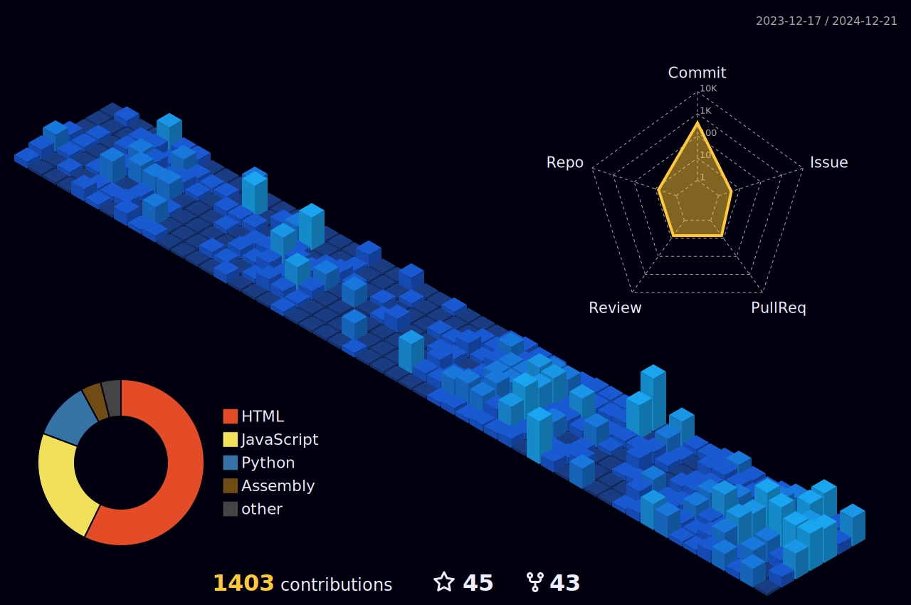

# Hi, I'm Maddox!  <!-- cool duck -->

> I'm currently working on a multitude of things, just trying to learn and be a better programmer💻. I work with frontend and backend, and my favorite language is Python.

Please <a href="mailto:maddoxpublic@gmail.com">Contact Me</a> if you have any questions about any of my open-source projects! 
### Languages

### OS

### Databases

### CI/CD

### Overview

### My Websites
-   [**duckmath.org**](https://duckmath.org) - Popular Games Site
-  [**mtype.dev**](https://mtype.dev) - WPM speed test
-  [**maddox.page**](https://maddox.page) - Website About Me

**📫 How to Reach me:**

  
  
  

  
  
  

  

